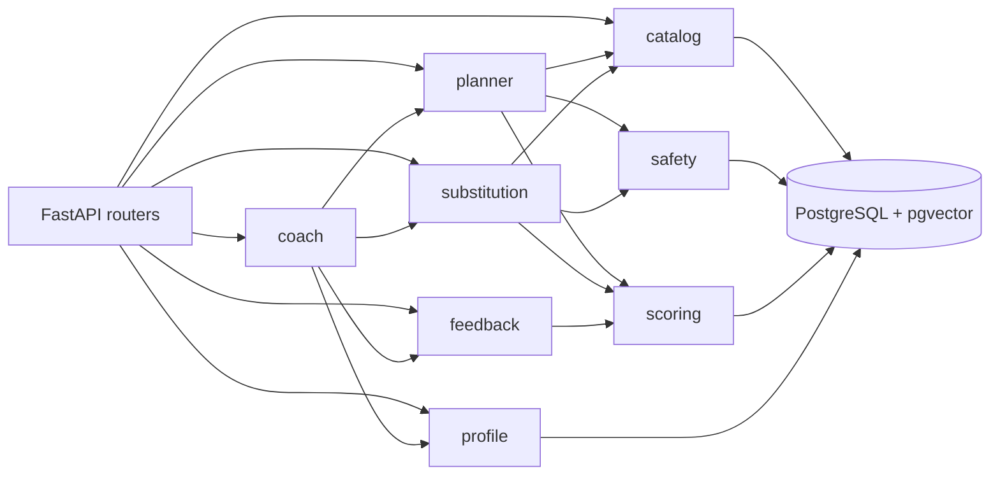

# FitEngine

Adaptive exercise recommendation backend built from `free-exercise-db`.

This implementation follows `fitengine-architecture.md` as a modular monolith:

- FastAPI app with SQLAlchemy and PostgreSQL/pgvector.
- Dataset ingestion from `seeds/exercises.json`.
- Deterministic injury-aware safety layer.
- Greedy + repair weekly planner with feasibility notes.
- Semantic exercise search and substitutions.
- Feedback loop for per-user preference scores.

The Docker build uses local MiniLM embeddings through
`sentence-transformers/all-MiniLM-L6-v2` and Gemini Flash behind `LLMClient`.

## Local Run

```powershell
docker compose up --build
```

Then open:

- API docs: <http://localhost:8000/docs>
- Health: <http://localhost:8000/health>

The app container runs database setup automatically on startup:

- `alembic upgrade head`
- `python -m seeds.bootstrap`

`seeds.bootstrap` loads the exercise catalog, safety metadata, and MiniLM
embeddings only when the deployed database is empty or missing embeddings. Set
`FORCE_SEED_DATA=true` to force a reload.

Run tests:

```powershell
docker compose exec app python -m pytest -q
```

## Frontend

The prototype UI is maintained separately from this backend repository:

- Frontend repo: <https://github.com/githubansh/ui-fit-engine>
- Local dev URL: <http://127.0.0.1:5173/>
- Backend API URL: <http://localhost:8000/>

## Render Deploy

The Docker startup command runs migrations and seed checks automatically, so no
Render shell is required for the free tier.

Set these environment variables in Render:

```text
DATABASE_URL=<your Render/Neon/Postgres URL>
GEMINI_API_KEY=<your real Gemini key>
GEMINI_MODEL=gemini-flash-latest
EMBEDDING_MODEL_NAME=sentence-transformers/all-MiniLM-L6-v2
RUN_DB_MIGRATIONS=true
RUN_SEED_DATA=true
FORCE_SEED_DATA=false
CORS_ORIGINS=https://<your-vercel-app>.vercel.app,http://localhost:5173,http://127.0.0.1:5173
```

On the first deploy the service may take longer while MiniLM downloads and
embeddings are generated. Later deploys skip seeding unless the database is
empty, embeddings are missing, or `FORCE_SEED_DATA=true`.

## Current Build Slice

The backend covers setup, ingestion, curation scaffolding, MiniLM embeddings,
safety, scoring, planner v1, substitutions, feedback/adaptation, Gemini-backed
intake hooks, coach tools, and demo seeding.

The LLM coach is intentionally isolated behind `LLMClient`; safety and planning
decisions never depend on LLM output.

## Architecture



## Demo Data

```powershell
docker compose exec app python -m seeds.load_demo
```

## Gemini / MiniLM

Create `.env` from `.env.example`, then set your real Gemini key:

```powershell
Copy-Item .env.example .env
# edit .env and set GEMINI_API_KEY
```

## Safety Curation Note

`seeds/movement_patterns.yaml` is generated from heuristics plus explicit
corrections. Before using this for real injury-sensitive recommendations, the
safety-relevant tags must be manually reviewed by a qualified human. The API
includes a medical-disclaimer string in plan params and never uses the LLM for
safety decisions.
